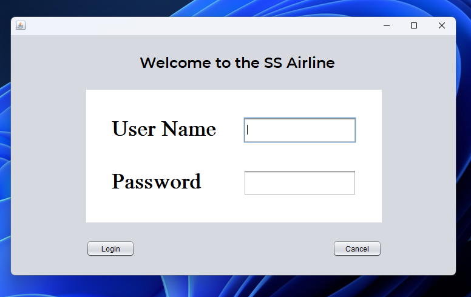
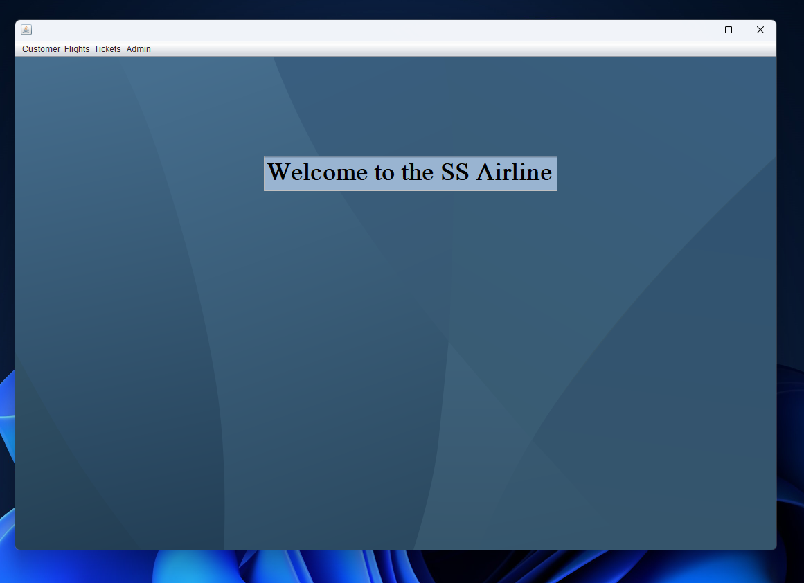
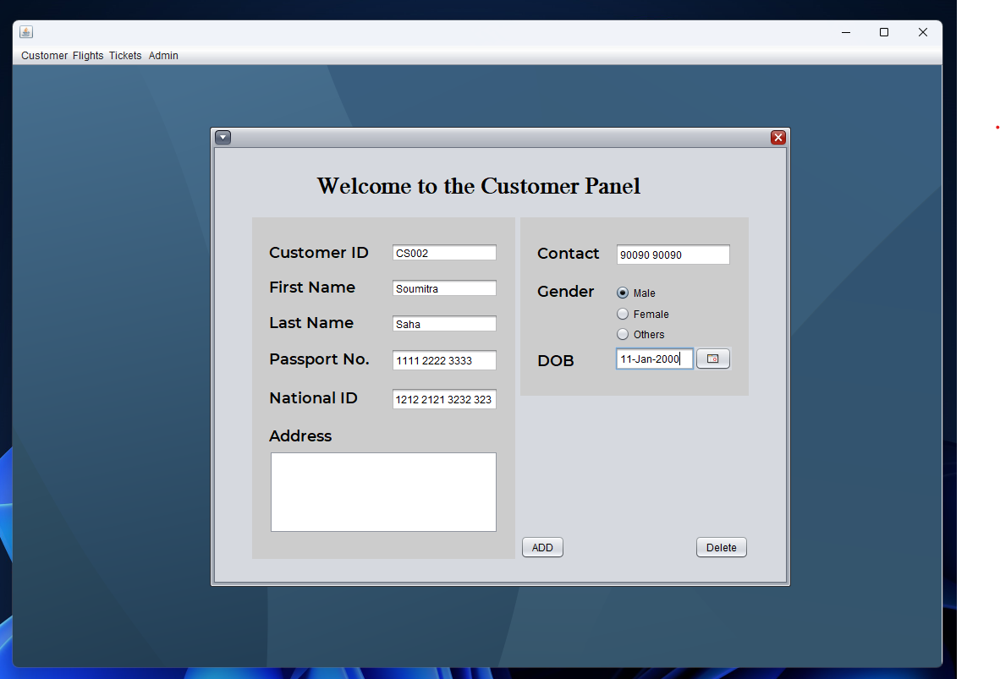
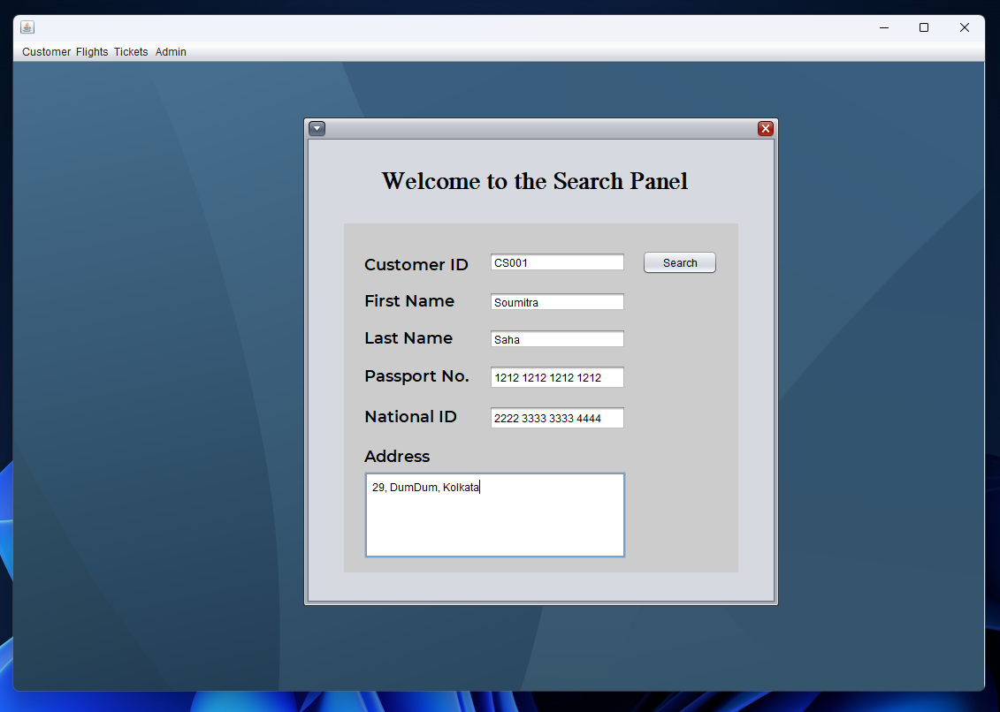
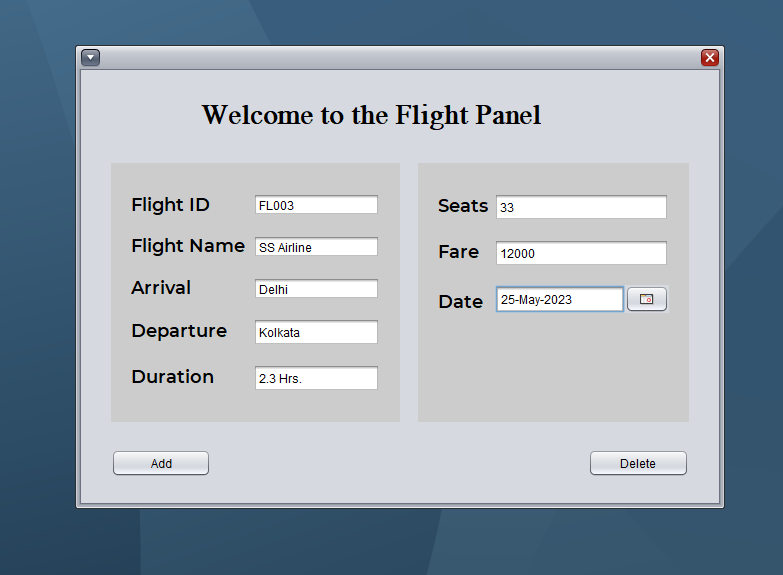
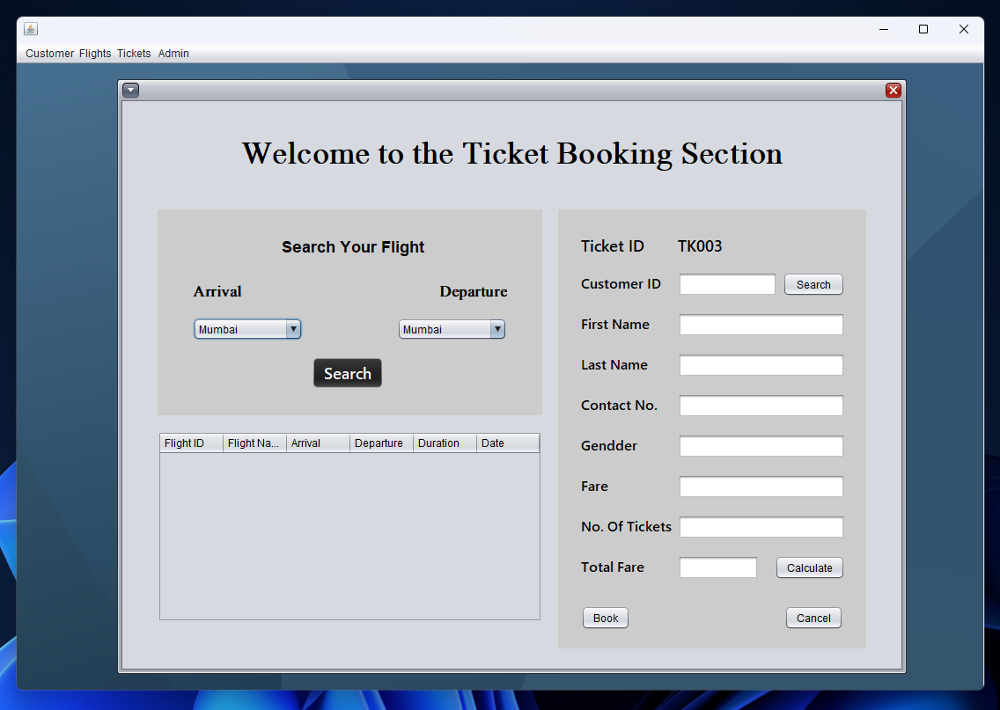
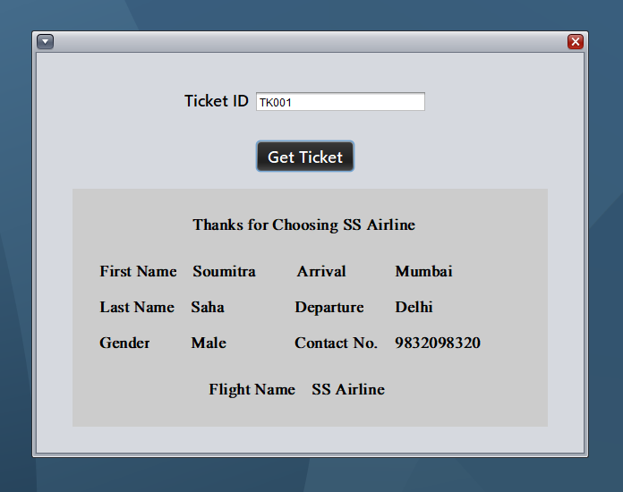

# Airline Reservation System

## Description

This project focuses on the technologies used in the Airline Reservation System and emphasizes the importance of understanding them. The system includes a Graphical User Interface (GUI) built using the Java Swing library, which consists of buttons, text fields, and other graphical elements for user interaction. Java Swing is an incredibly robust library that offers a wide array of features and functionality, making it indispensable for constructing the front end of a project. To design the user interface for the project, we will leverage essential components like JFrame, JButton, and JPanel from the Java Swing framework.

## Tech. Stack

- Java Swing: A powerful library for developing graphical user interfaces (GUIs).
- Core Java: The foundation of the project, providing essential libraries and tools for general-purpose programming.
- OOPs: Object-Oriented Programming principles guide the development approach, promoting modular design and code reusability.
- Database: Integration of a database for data persistence and efficient data management.
- SQL: The use of Structured Query Language for managing relational databases, allowing for querying, inserting, updating, and deleting data.
- JDBC: Java Database Connectivity enables seamless communication and integration between the Java application and the database.

## Pictures

## Author

Soumitra Saha

twitter: https://twitter.com/SoumitraSaha100/

linkedin: https://www.linkedin.com/in/soumitra-saha-a9810622a/
